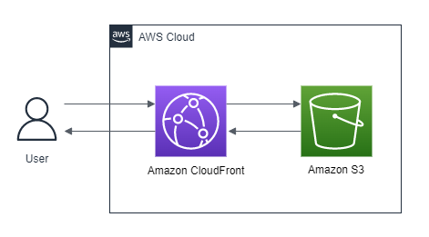

# AWS Terraform CloudFront S3 
This module creates an S3 bucket (for files or static website hosting) and enables you to access it through a CloudFront Distribution.

The following diagram shows an overview of how this module works:



## Features

1. Creates an S3 Bucket 
2. Creates a CloudFront Distribution that is configured with and OAI to make sure the website is only accesible via CloudFront


## Usage
To deploy the solution to AWS. Use the following terraform commands:

```shell
$terraform init
```
```shell
$terraform plan
```
```shell
$terraform apply
```

**To replace the website's default content with your own:**

Delete the default `index.html` and replace it with your own files.
 

<!-- BEGIN_TF_DOCS -->
## Requirements

| Name | Version |
|------|---------|
| <a name="requirement_random"></a> [random](#requirement\_random) | ~> 3.1.0 |

## Providers

| Name | Version |
|------|---------|
| <a name="provider_aws"></a> [aws](#provider\_aws) | n/a |
| <a name="provider_random"></a> [random](#provider\_random) | ~> 3.1.0 |

## Modules

No modules.

## Resources

| Name | Type |
|------|------|
| [aws_cloudfront_distribution.web_distribution](https://registry.terraform.io/providers/hashicorp/aws/latest/docs/resources/cloudfront_distribution) | resource |
| [aws_cloudfront_origin_access_identity._](https://registry.terraform.io/providers/hashicorp/aws/latest/docs/resources/cloudfront_origin_access_identity) | resource |
| [aws_s3_bucket.bucket](https://registry.terraform.io/providers/hashicorp/aws/latest/docs/resources/s3_bucket) | resource |
| [aws_s3_bucket_acl.b_acl](https://registry.terraform.io/providers/hashicorp/aws/latest/docs/resources/s3_bucket_acl) | resource |
| [aws_s3_bucket_policy._](https://registry.terraform.io/providers/hashicorp/aws/latest/docs/resources/s3_bucket_policy) | resource |
| [aws_s3_bucket_website_configuration.website_config](https://registry.terraform.io/providers/hashicorp/aws/latest/docs/resources/s3_bucket_website_configuration) | resource |
| [random_pet.bucket_name](https://registry.terraform.io/providers/hashicorp/random/latest/docs/resources/pet) | resource |
| [aws_iam_policy_document.bucket_policy_doc](https://registry.terraform.io/providers/hashicorp/aws/latest/docs/data-sources/iam_policy_document) | data source |

## Inputs

| Name | Description | Type | Default | Required |
|------|-------------|------|---------|:--------:|
| <a name="input_bucket_prefix"></a> [bucket\_prefix](#input\_bucket\_prefix) | Specify the prefix for the bucket name | `string` | `"s3-cloudfront"` | no |
| <a name="input_compress"></a> [compress](#input\_compress) | Specify either cached objects are compressed or not | `bool` | `true` | no |
| <a name="input_default_ttl"></a> [default\_ttl](#input\_default\_ttl) | Default TTL Value (in seconds) | `number` | `300` | no |
| <a name="input_index_document_suffix"></a> [index\_document\_suffix](#input\_index\_document\_suffix) | Index document for static website | `string` | `"index.html"` | no |
| <a name="input_max_ttl"></a> [max\_ttl](#input\_max\_ttl) | Minimal TTL Value (in seconds) | `number` | `3600` | no |
| <a name="input_min_ttl"></a> [min\_ttl](#input\_min\_ttl) | Minimal TTL Value (in seconds) | `number` | `0` | no |
| <a name="input_use_for_website"></a> [use\_for\_website](#input\_use\_for\_website) | Specify either the website is used for a static website hosting or for files | `bool` | `false` | no |

## Outputs

| Name | Description |
|------|-------------|
| <a name="output_S3_bucket_arn"></a> [S3\_bucket\_arn](#output\_S3\_bucket\_arn) | Get the ARN of the bcuket |
| <a name="output_cloudfront_arn"></a> [cloudfront\_arn](#output\_cloudfront\_arn) | Get the ARN of the distribution |
| <a name="output_cloudfront_domain_name"></a> [cloudfront\_domain\_name](#output\_cloudfront\_domain\_name) | The domain name corresponding to the distribution |
<!-- END_TF_DOCS -->